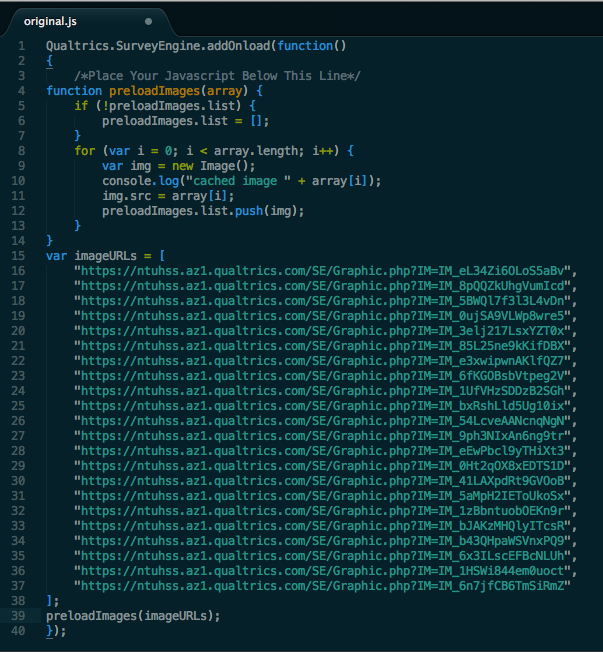
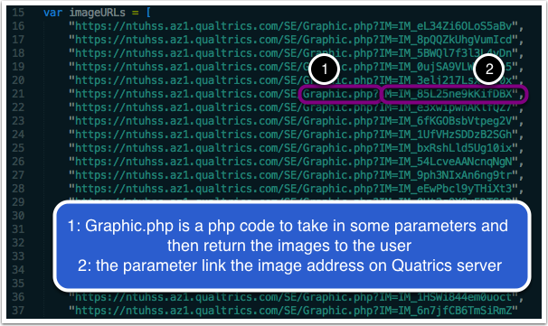
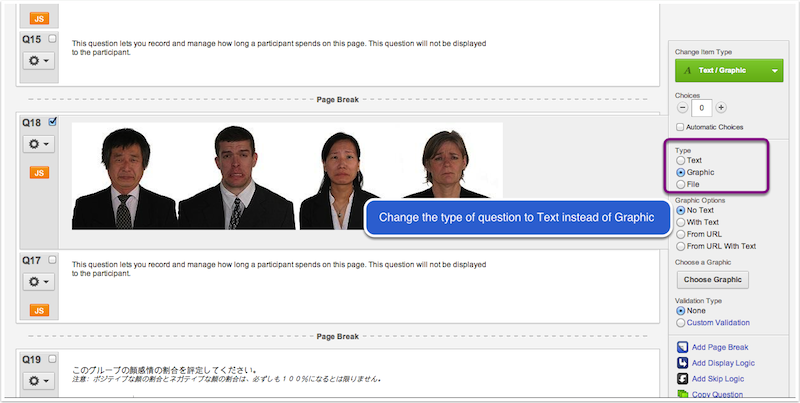
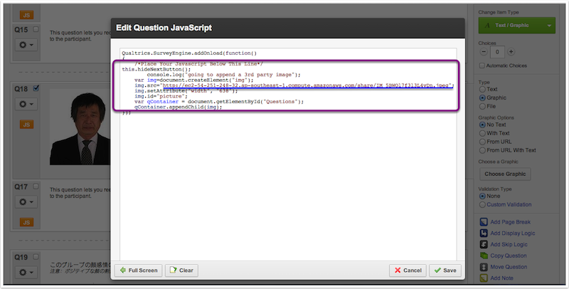
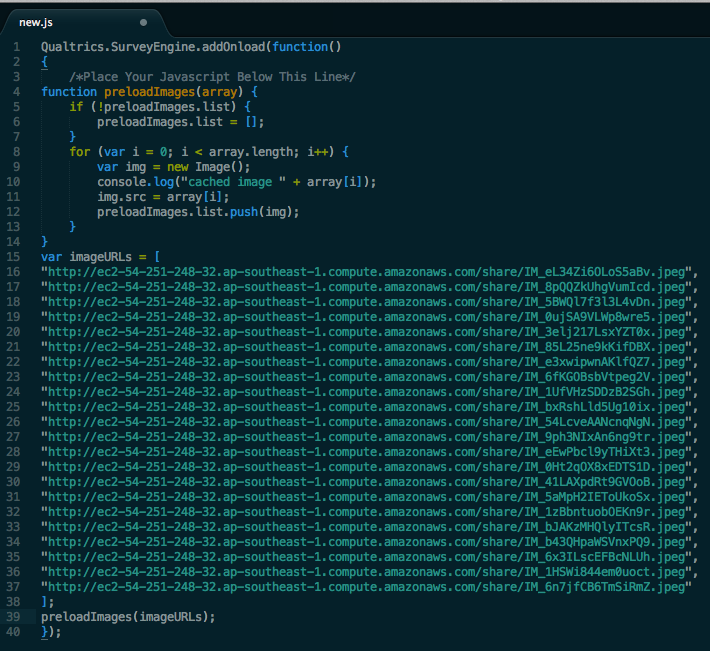
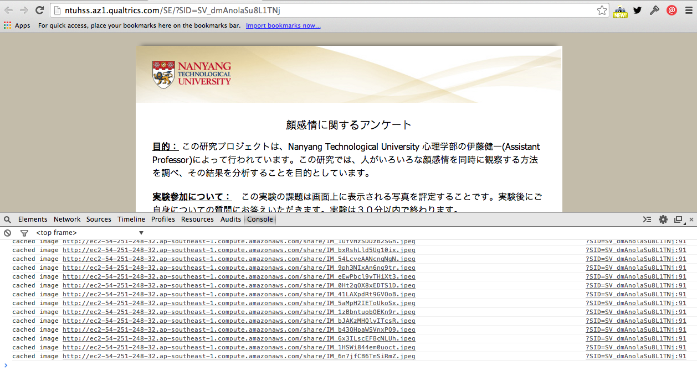
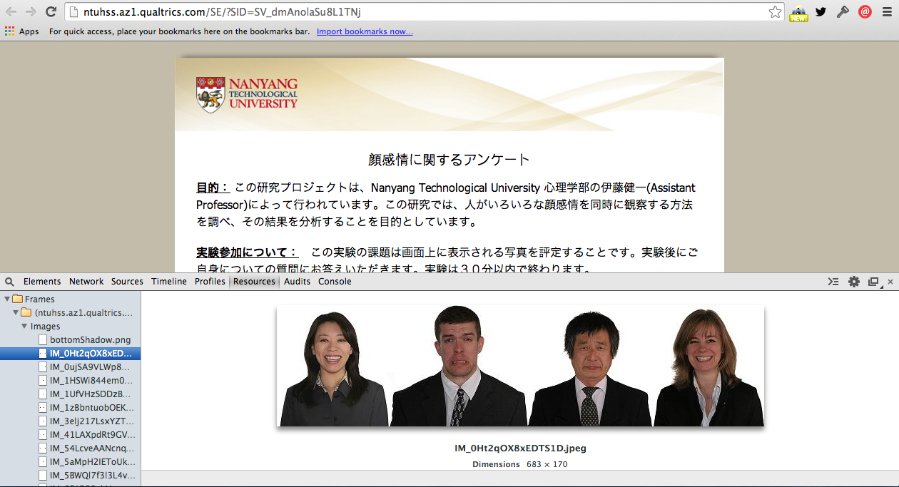

## A Quatrics case study

###Background
Quatrics user need an image in questionnaire to appear only 0.5 second, then proceed to next question.

### Problem
When participants in a poor network, downloading the image might take some time, and user would see the image showing downwards gradually, the Quatrics’s 0.5 delay is only after the web page is full loaded, in this situation the participants would have more than 0.5 second to look at the image, which defeats the purpose of the questionnaire.


### Solution
Main idea here is to preload the images during the participants read agreement section, initial javascript code is as below:



During testing of this solution, it was found the links did preload during reading the agreement section. However, when goes to questions containing the image, it still behaved as before, the webpage seems not detect the cached images at all, it queries from Quatrics server and download the image again.

The root cause of this situation is how Quatrics prodive their image links, for example, ```https://ntuhss.az1.qualtrics.com/SE/Graphic.php?IM=IM_eL34Zi6OLoS5aBv``` is different with normal image links such as ```http://i.imgur.com/T0AnIKOb.jpg```


What happends when using Quatrics graphic links can be explained as below:



so each time when loading the questionnaire contains the image, it will call Graphic.php to look for the image and downlaod the image for the user.


A work around for this case is we provide our own image links for the question, insead of using Quatrics graphic upload.


Here is what has done:

#### step1: change question type to text


#### step2: add javascript for each question
When the question type is text, we can append images to the question using javascript, the image will be loaded together then goest to that question.


I have uploaded the images to amazon server and the image links are like: ```http://abc.com/share/sample.jpeg``` style

#### step3: preload those images with new links in agreement session:
add these javascript code to the agreement section:


After all the changes made, I have done some basic testing and here are the results:


From above screenshot we can see the images were cached correctly during agreement session and stored.

Then go ahead with the questionaire and did not encounter the loading issue.

